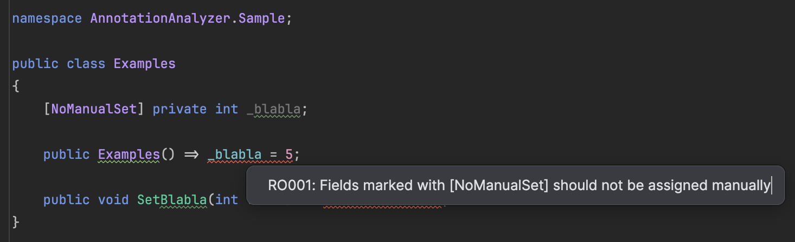

# A sample of Roslyn analyzer
- `NoManualSetAnalyzer` should detect the usage of fields with `NoManualSetAttribute`
  - It should report an error if the field is assigned a value

```csharp
[AttributeUsage(AttributeTargets.Field)]
public class NoManualSetAttribute : Attribute
{
}
```

- Here is the implementation of the `Analyzer`:

```csharp
[DiagnosticAnalyzer(LanguageNames.CSharp)]
public class NoManualSetAnalyzer : DiagnosticAnalyzer
{
    private static readonly DiagnosticDescriptor Rule = new(
        id: "RO001",
        title: "Field marked with [NoManualSet] should not be set manually",
        messageFormat: "Fields marked with [NoManualSet] should not be assigned manually",
        category: "Usage",
        DiagnosticSeverity.Error,
        isEnabledByDefault: true);

    public override ImmutableArray<DiagnosticDescriptor> SupportedDiagnostics => ImmutableArray.Create(Rule);

    public override void Initialize(AnalysisContext context)
    {
        context.ConfigureGeneratedCodeAnalysis(GeneratedCodeAnalysisFlags.None);
        context.EnableConcurrentExecution();

        // Register action for field assignments
        context.RegisterSyntaxNodeAction(AnalyzeAssignment, SyntaxKind.SimpleAssignmentExpression);
    }

    private static void AnalyzeAssignment(SyntaxNodeAnalysisContext context)
    {
        var assignment = (AssignmentExpressionSyntax) context.Node;

        // Get the left-hand symbol (the field being assigned)
        var leftSymbol = ModelExtensions.GetSymbolInfo(context.SemanticModel, assignment.Left).Symbol as IFieldSymbol;
        if (leftSymbol == null) return;

        // Check if the field has the [NoManualSet] attribute
        if (!leftSymbol.GetAttributes().Any(a => a.AttributeClass?.Name == "NoManualSetAttribute")) return;

        // Report diagnostic
        var diagnostic = Diagnostic.Create(Rule, assignment.GetLocation(), leftSymbol.Name);
        context.ReportDiagnostic(diagnostic);
    }
}
```

- Here is the result:


# MS Docs

A set of three sample projects that includes Roslyn analyzers with code fix providers. Enjoy this template to learn from and modify analyzers for your own needs.

## Content
### AnnotationAnalyzer
A .NET Standard project with implementations of sample analyzers and code fix providers.
**You must build this project to see the results (warnings) in the IDE.**

- [SampleSemanticAnalyzer.cs](SampleSemanticAnalyzer.cs): An analyzer that reports invalid values used for the `speed` parameter of the `SetSpeed` function.
- [SampleSyntaxAnalyzer.cs](SampleSyntaxAnalyzer.cs): An analyzer that reports the company name used in class definitions.
- [SampleCodeFixProvider.cs](SampleCodeFixProvider.cs): A code fix that renames classes with company name in their definition. The fix is linked to [SampleSyntaxAnalyzer.cs](SampleSyntaxAnalyzer.cs).

### AnnotationAnalyzer.Sample
A project that references the sample analyzers. Note the parameters of `ProjectReference` in [AnnotationAnalyzer.Sample.csproj](../AnnotationAnalyzer.Sample/AnnotationAnalyzer.Sample.csproj), they make sure that the project is referenced as a set of analyzers. 

### AnnotationAnalyzer.Tests
Unit tests for the sample analyzers and code fix provider. The easiest way to develop language-related features is to start with unit tests.

## How To?
### How to debug?
- Use the [launchSettings.json](Properties/launchSettings.json) profile.
- Debug tests.

### How can I determine which syntax nodes I should expect?
Consider installing the Roslyn syntax tree viewer plugin [Rossynt](https://plugins.jetbrains.com/plugin/16902-rossynt/).

### Learn more about wiring analyzers
The complete set of information is available at [roslyn github repo wiki](https://github.com/dotnet/roslyn/blob/main/docs/wiki/README.md).